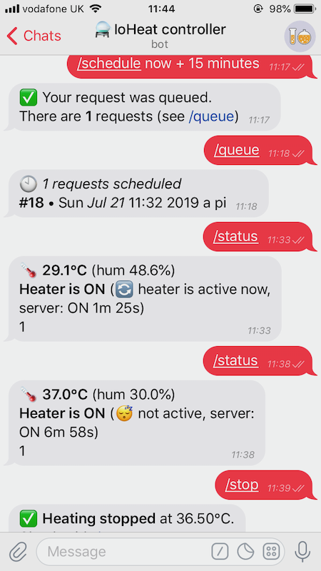

Conference in the Cloud (A Perl and Raku Conference) 2020 - Lightning Talk

* [Talk: distributing a Perl module via Bioconda](#Distributing-a-Perl-module-via-Bioconda)
* [Extra: a Perl module that avoided coding a mobile app](#A-module-that-helped-me-interacting-with-a-device)

# Distributing a Perl module via Bioconda

> When you develop a tool that requires external applications (or compiled binaries), CPAN is not the easiest way of distributing it. I'll show how Miniconda became the favourite package manager in the bioinformatics community, with a tiny tutorial using the "BioConda channel" as an example.

Perl has a long history of serving the bioinformatics community, and nowadays "Miniconda" has become the most used package and dependency manager for bioinformaticians, with a very active channel called "BioConda". In this lightning talk I'll use BioConda as an example of bringing Perl tools (and modules) to Miniconda.  Despite Miniconda being born in the Python world, 10% of all Bioconda packages are Perl modules, and several highly downloaded programs are written in Perl.

## About me

I'm [Andrea Telatin](https://telatin.github.io/), a bioinformatics researcher at the [Quadram Institute Bioscience](https://www.quadram.ac.uk) in Norwich (UK).
I started using Perl in 2004, and never completely abandoned it, and a couple of years ago I tried making my way into [CPAN](https://metacpan.org/author/PROCH) and that has been amazing (as trying to make a module, I discovered many great ones I never heard of).

## The problem

Bioinformatics analyses rely on a **massive amount of dependencies**, sometimes incompatible packages or different versions of the same package are required. 
Some years ago a lot of tools were difficult to install as they required some competency in different languages, and at the same time distributing Perl code was difficult as most users had no idea how to install the needed modules.

## The solution

Anaconda is a Python distribution (born for scientific computing) that combines Python and **conda**, that is both a _package manager_ and an _environment manager_. My coding machine is a Mac, but my analyses run on a Linux HPC. With conda I can install most of the times the exact same packages in both development and production environments with ease. 

**[Miniconda](https://docs.conda.io/en/latest/miniconda.html)** is the stiped-down version of Anaconda, and is the _de facto_ standard in package management for bioinformaticians, also being relatively easy to [install](https://docs.conda.io/en/latest/miniconda.html) both in Linux and in macOS.

Installing a package, like [imagemagick](https://anaconda.org/search?q=imagemagick) is as easy as:
```
conda install -c conda-forge imagemagick
```

If you need a set of packages isolated from the others, you can create an environment:

```
conda create -n my_environment -c bioconda perl perl-www-mechanize perl-yaml-pp  
```
and, to use it:
```
conda activate my_environment

```

To give an idea of the popularity of the system, a Perl program I use frequently is called **[Prokka](https://anaconda.org/bioconda/prokka)**,
and it has been installed [](https://anaconda.org/bioconda/prokka) times with Miniconda!  

## Conda "channels"

Channels are like repository sources in other package managers. Just signing up to [anaconda.org](https://anaconda.org) you will be able to upload your packages to your own channel. You'll need to "build" your own packages though.


BioConda - the bioinformatics source - currently hosts more than 7.000 packages, of which more than 700 are perl modules. Your `Fantastic::Module` would be called `perl-fantastic-module` in the conda nomenclature.

[BioConda](https://bioconda.github.io/) is a repository (hosted on GitHub) of conda recipes, but also a building system. You just need to submit a pull request with your new recipe to have it added by the BioConda team. 

### A (Bio)Conda "recipe" for a generic `Module::Name`

A recipe consists of minimum two files:

* meta.yaml (containing all the dependencies needed, the source URLs and some other metadata). Example [here](https://gist.github.com/telatin/e572e388edb1603705beef0830152381)
* build.sh (if your module has Build.PL or Makefile.PL, the generic template is [like this](https://github.com/bioconda/bioconda-recipes/blob/master/recipes/perl-capture-tiny/build.sh).

### A (Bio)Conda "recipe" for a Perl program

A good example is having a look at [the recipe](https://github.com/bioconda/bioconda-recipes/tree/master/recipes/prokka) for the already mentioned Prokka.
### Adding a new recipe

Every recipe lives in a subfolder of the `[bioconda-recipes]()` repository. The [workflow](https://bioconda.github.io/contributor/workflow.html) is:
* Fork the repository
* Add your `perl-module-name` (or just `packagename` if its a program rather than a module) folder with the proper _meta.yaml_ and _build.sh_
* Create a Pull Request (called "Add packagename") and follow the instructions from BioCondaBot

## The generic "conda-forge"

Of course, BioConda specializes on bioinformatics packages. At the same time, the widespread use of Perl among bioinformaticians made several Perl modules (like **Capture::Tiny**) only available via BioConda.

There is at the moment the idea of moving non bioinformatics packages (and modules) to the more appropriate [conda-forge](https://conda-forge.org/) channel.


## Final remarks

I'm grateful for the opportunity of joining the Perl and Raku conference this year. 
I had a long journey with Perl and I would like to thank you all for your efforts in maintaining packages, documentations, and helping people.


📑 **[Slides](https://github.com/telatin/learnperl/blob/master/TPRCiC/bioconda_slides.pdf)**


---

# A Perl module that helped me interacting with a device

Last year I joined a [team of _biohackers_](https://www.hackster.io/ioheat/ioheat-a-contained-oasis-in-the-coldroom-fb4dec) to make a small prototype of a heating device using a Raspberry Pi. It's a glorified heater that we wanted to remotely control to enable a heating cycle to start (it takes >30 minutes) when leaving home to reach the laboratory, so that we could find the required reagents warm when arriving at the lab.

We had limited time, so first we did the scripts to control the temperature (in Python: better support of the RPis GPIO).

Then we wanted to make a **mobile interface**. I was considering a standard web application hosted somewhere but that would easily eat up a lot of time, so I came up with a totally different approach: controlling the device with a **Telegram bot**.

Thanks to `WWW::Telegram::BotAPI` this became easy to implement. 

🔗 [WWW::Telegram::BotAPI](https://metacpan.org/pod/WWW::Telegram::BotAPI)

Example: 



The team:

[](https://www.hackster.io/ioheat/ioheat-a-contained-oasis-in-the-coldroom-fb4dec)
